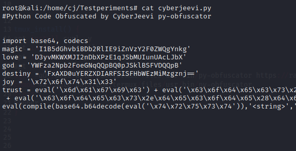

# py-obfuscator
Simple Python Script Obfuscator Tool By CyberJeevi | Cyber Arena

### Documentation

Py-Obfuscator is a Simple Python Obfuscator Tool Made with BASH!!

It Obfuscate Python Codes with Haxx0r's Enc.

Simple Obfuscation takes place here.

OutPut Example :

### Installation
```
git clone https://github.com/cyberjeevi/py-obfuscator/
cd py-obfuscator/
chmod +x setup.sh
bash setup.sh
```
After above INSTALLATION Codes:

For Termux User : Input 1 to Install 

For GNU/Linux Users : Input 2 to Install


Issue: [Open Ticket](https://github.com/cyberjeevi/py-obfuscator/issues/new)

Feedback : [Email Me](cyberjeevi@gmail.com)

### Donate:
Upi : cyberjeevi@upi
BitCoin : 3GLYFbsXpRvhzP9AJLkF1XFq85vN95QPiP
